# Task Tracker API

## Project Overview

Task Tracker API is a simple RESTful Web API built with ASP.NET Core
(.NET 10). The project manages users and their tasks while following
REST principles learned during training.

### Features

-   User CRUD operations
-   Task CRUD operations
-   Nested resource: `/api/v1/users/{id}/tasks`
-   API versioning using `/api/v1`
-   Correct HTTP status codes
-   Tested using Postman
-   Documented with Swagger

------------------------------------------------------------------------

## Technologies Used

-   C#
-   ASP.NET Core Web API
-   .NET 10
-   LINQ
-   Swagger (OpenAPI)
-   Postman
-   Git & GitHub

------------------------------------------------------------------------

## Project Structure

``` text
TaskTrackerApi
│
├── Controllers
│   ├── UsersController.cs
│   └── TasksController.cs
├── Models
│   ├── User.cs
│   └── TaskItem.cs
├── Data
│   └── AppData.cs
├── Program.cs
└── TaskTrackerApi.csproj
```

------------------------------------------------------------------------

## REST API Endpoints

### Users

  Method   Endpoint             Description         Success
  -------- -------------------- ------------------- ----------------
  GET      /api/v1/users        Get all users       200 OK
  GET      /api/v1/users/{id}   Get user by ID      200 OK
  POST     /api/v1/users        Create a new user   201 Created
  PUT      /api/v1/users/{id}   Update a user       200 OK
  DELETE   /api/v1/users/{id}   Delete a user       204 No Content

### Tasks

  Method   Endpoint             Description         Success
  -------- -------------------- ------------------- ----------------
  GET      /api/v1/tasks        Get all tasks       200 OK
  GET      /api/v1/tasks/{id}   Get task by ID      200 OK
  POST     /api/v1/tasks        Create a new task   201 Created
  PUT      /api/v1/tasks/{id}   Update a task       200 OK
  DELETE   /api/v1/tasks/{id}   Delete a task       204 No Content

### Nested Resource

`GET /api/v1/users/{id}/tasks`

Returns all tasks that belong to a specific user.

------------------------------------------------------------------------

## HTTP Status Codes

  Code   Meaning       Used For
  ------ ------------- -------------------------
  200    OK            Successful GET and PUT
  201    Created       Successful POST
  204    No Content    Successful DELETE
  400    Bad Request   Invalid request
  404    Not Found     Resource does not exist

------------------------------------------------------------------------

## LINQ Used

-   `Where()`
-   `FirstOrDefault()`
-   `Any()`

------------------------------------------------------------------------

## Postman Test Cases

  ----------------------------------------------------------------------------------- 
  Test ID        Method         Endpoint                Expected       Result         
  -------------- -------------- ----------------------- -------------- -------------- 
  TC-001         GET            /api/v1/users           200 OK         PASS           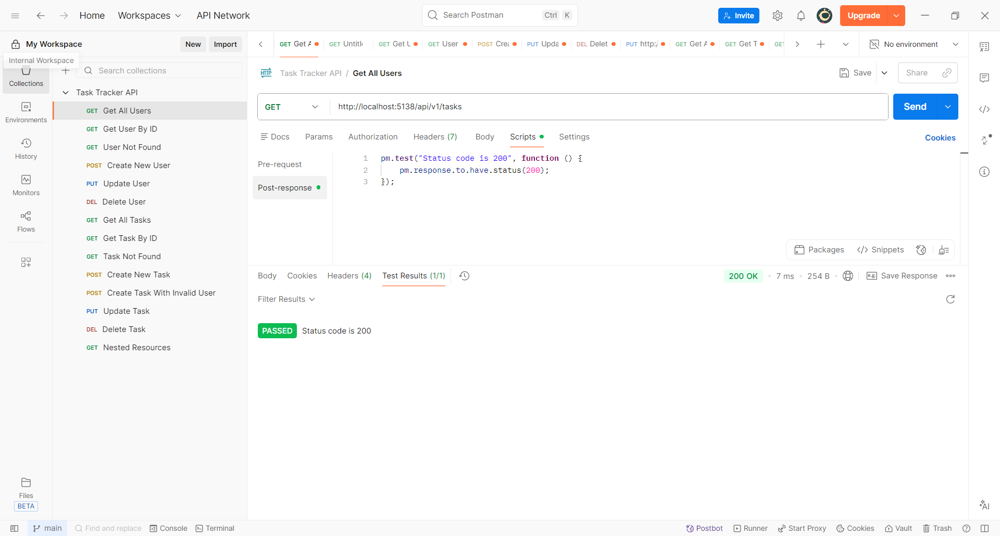

  TC-002         GET            /api/v1/users/1         200 OK         PASS           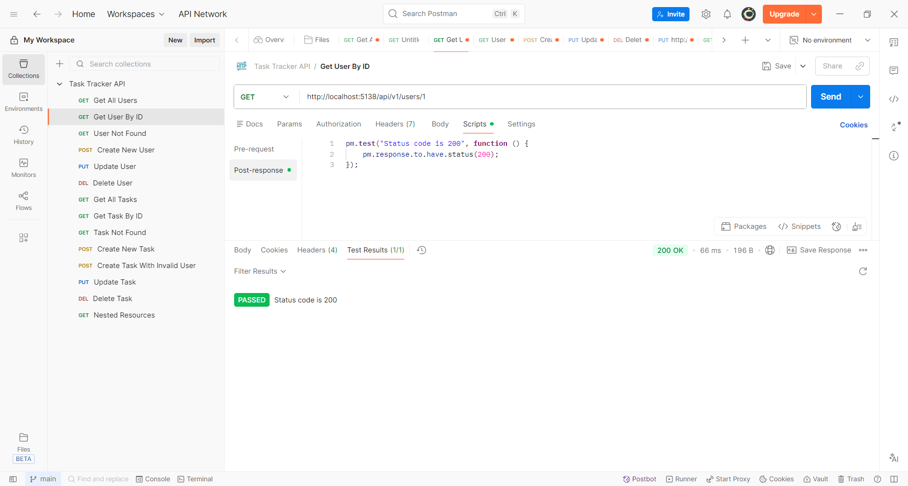

  TC-003         GET            /api/v1/users/99        404 Not Found  PASS           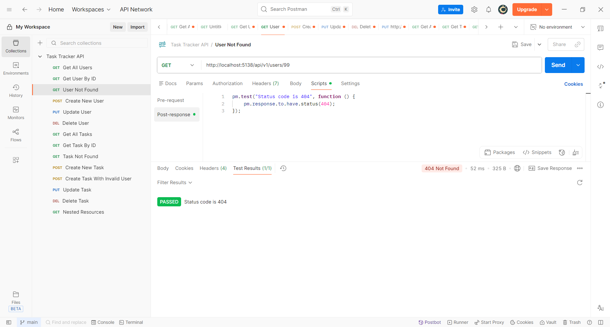

  TC-004         POST           /api/v1/users           201 Created    PASS           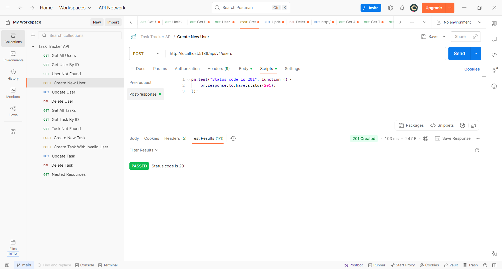

  TC-005         PUT            /api/v1/users/1         200 OK         PASS           

  TC-006         DELETE         /api/v1/users/1         204 No Content PASS           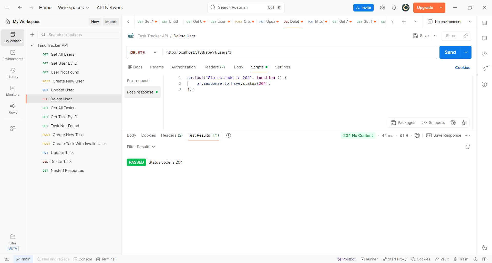

  TC-007         GET            /api/v1/tasks           200 OK         PASS           

  TC-008         GET            /api/v1/tasks/1         200 OK         PASS           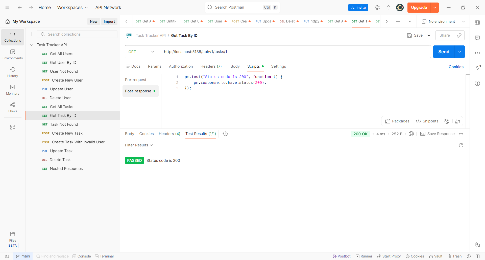
  
  TC-009         GET            /api/v1/tasks/99        404 Not Found  PASS                    

  TC-010         POST           /api/v1/tasks           201 Created    PASS           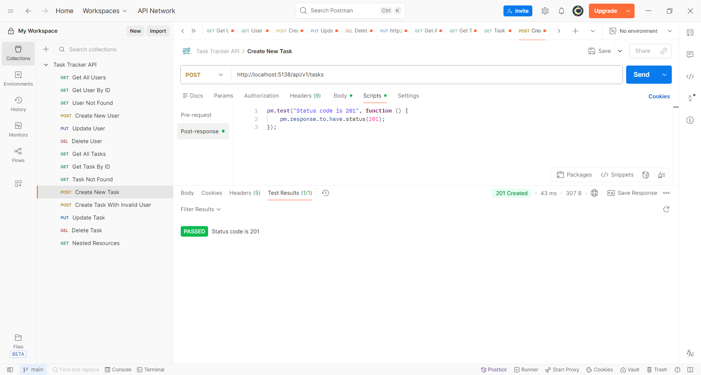         

  TC-011         POST           /api/v1/tasks (invalid  400 Bad        PASS           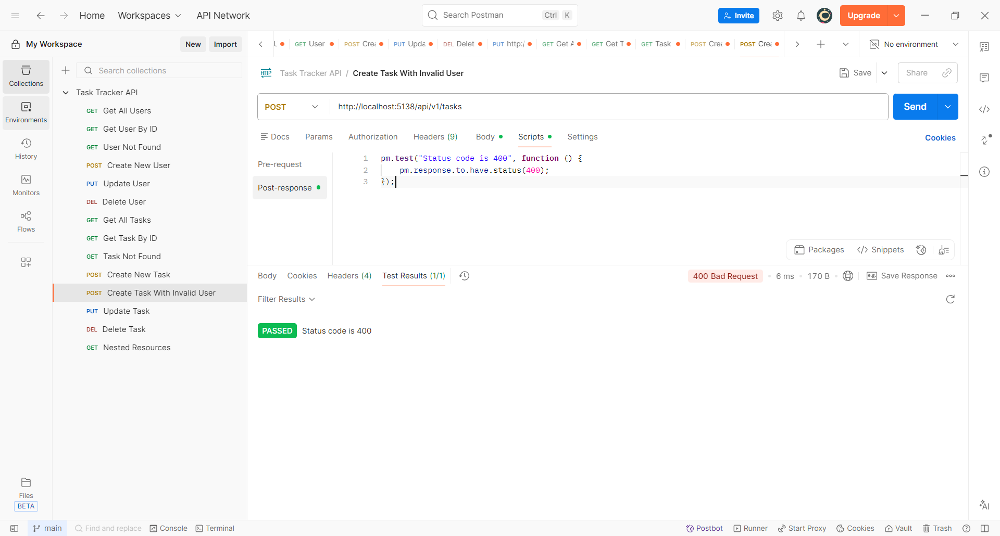
                                UserId)                 Request        

  TC-012         PUT            /api/v1/tasks/1         200 OK         PASS           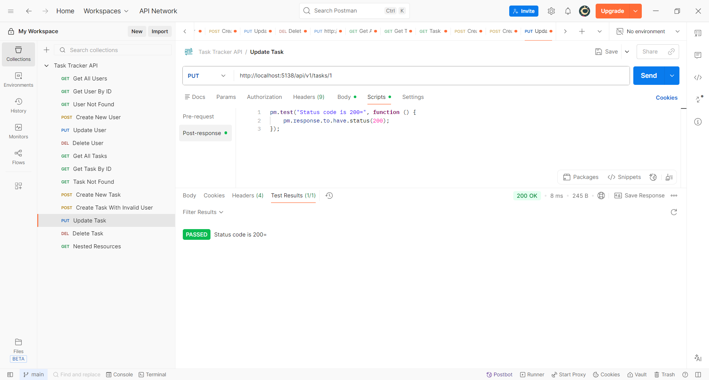

  TC-013         DELETE         /api/v1/tasks/1         204 No Content PASS           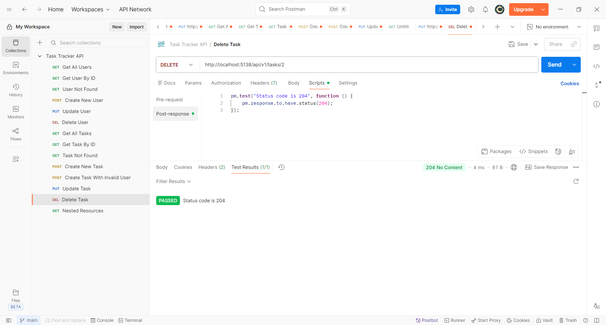

  TC-014        GET            /api/v1/users/1/tasks   200 OK         PASS            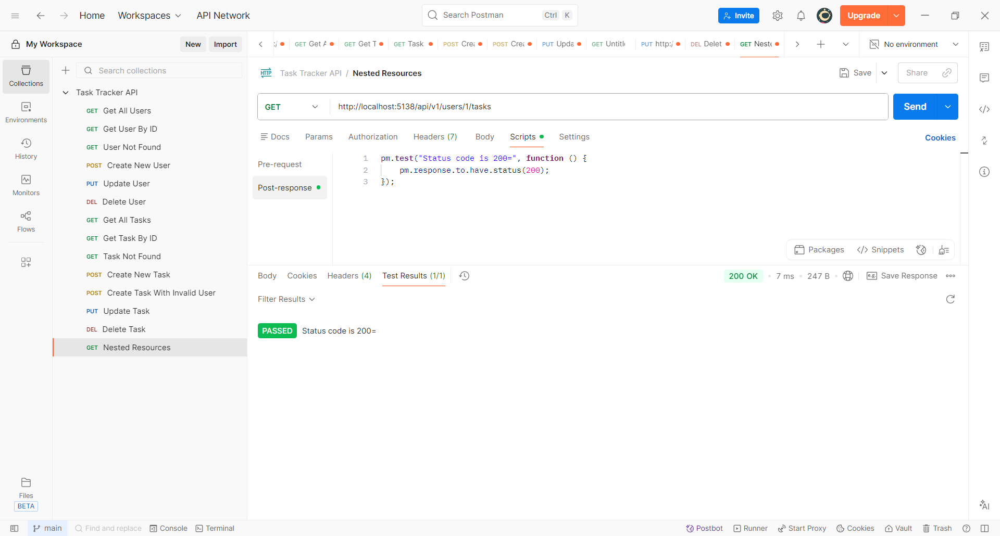  
  -----------------------------------------------------------------------------------

------------------------------------------------------------------------

## Screenshots

 1. Swagger home page
    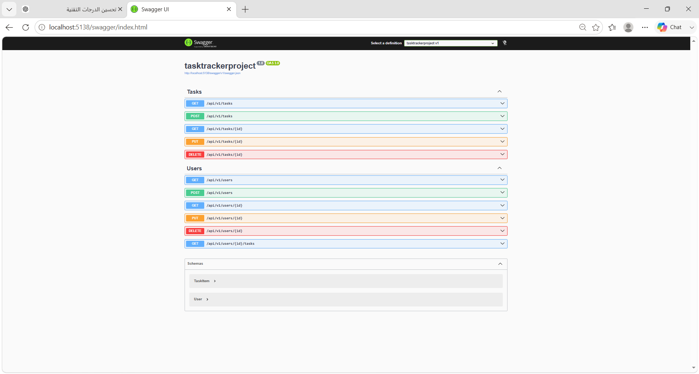

 2. Postman Collection
    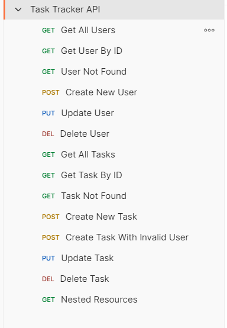

    

------------------------------------------------------------------------

## How to Run

``` bash
git clone <repository-url>
cd TaskTrackerApi
dotnet run
```

Open:

`http://localhost:5138/swagger`

------------------------------------------------------------------------

## What I Learned

-   REST API design
-   Resource naming
-   HTTP methods
-   HTTP status codes
-   API versioning
-   Controllers and routing
-   LINQ basics
-   Swagger
-   Postman API testing
-   GitHub project documentation
